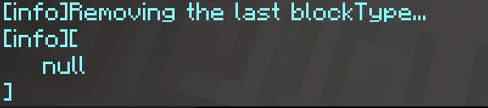
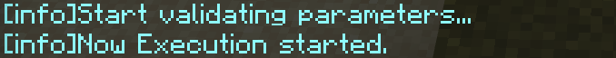
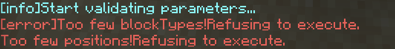

## Welcome to NC!

NormaConstructor is a multi-platform WorldEdit-like addon of bedrock version. It allows you to create simple geometry, pre-built buildings and even [Redstone Music](https://www.bilibili.com/video/BV1NA41137on/), whether you are in a single player game or a multi-player game! We strive to provide users with the simplest possible operation method, while ensuring that its functions are powerful enough to meet your various complex needs.
## Install NC

When using NC, players need custom tools provided by its supporting behavior package to set parameters. So even players who use the lxl version of NC (Integral) need to install the addon.

For users of win10 one player version (based on scripting version), as mentioned by mcpedl, download the latest version from <https://github.com/NorthernOceanS/NormaConstructor/releases>.

For users of the above mentioned lxl version of NC (Integral), please download and import <https://www.minebbs.com/threads/integral-nc-lxl-addon.7646/>.

## Get started
### reparation

In the previous step, NC should have successfully added the custom tool to your game. Open the inventory in creative mode, or type `give @s` and try to complete the command (the namespace of all NC custom tools is `normaconstructor`) can help you confirm whether this step is successful.

Now enter `/function getTools`, this command will enable you to quickly get all the tools needed to use NC. You can leave only `get_position`, `remove_last_position`, `remove_last_blocktype` and `execute`, temporarily put the remaining items in the inventory.
### Example: Create a solid cube with two points

The two-point generating cuboid is the first function loaded after the NC is started. To use it, first click on the two points you want to fill with `getPosition`. If successful when setting the positions, NC will prompt you the following information.

If you have set two positions, the new positions will not be accepted when you try to set again. At this time, NC will prompt you:

What should I do if I set wrong positions? `remove_last_position` will help you delete the last set position.

Next, you need to set a blocktype. The way to set the blocktype is to place a block directly on the ground. Similarly, NC will prompt you at this time

Delete the last blocktype (for two-point generation, there is only one blocktype) using `remove_last_blocktype`

The first line shows that NC is trying to delete this blocktype, and the second line is a list of saved blocktypes. You can see that there is only one `null`, which means that the current list is empty and new data can be accepted.

After the setting is complete, use execute to click the ground. NC will prompt

Generally speaking, the generation is successful. You should see a cuboid.

If there is a problem with the parameter, NC will point out the cause of the problem. The following is an example

## Learn more

NC, as a addon similar to worldedit, is slightly different in its behavior. Various operations of worldedit need to be executed through commands. At present, NC uses more in-game items and interactive interfaces to allow users to set various parameters. In addition, NC introduced the concept of **generator**.
### Generator

Behind every function of NC is a generator. A generator accepts the parameters you set, and when you use `execute`, it will first check your parameters, and then generate a series of instructions for placing blocks based on the parameters you provide. Hence its name.

Each generator is independent of each other, and the data stored in it is not shared.

For ordinary users, there is no need to know too much about generators. If interested developers want to create their own generators, please refer to the development documentation.
### Tools used by NC

In the age of blocklauncher, the ancient master 6g3y created a quick construction listening to the player's click (equivalent to the right mouse button) event on the ground, and set positions and blocks accordingly, or directly start generating.

NC is more "strict". These functions are split and assigned to a single tool. Specifically, the tools used by NC are

| Parameter setting tool | `get_position, getdirection, (place the square directly), get_air` |
| ------------- | ------------- |
| Parameter removal tool | `remove_last_position,remove_last_direction,remove_last_blocktype` |
| Other tools | show_menu,show_saved_data,execute,choose_next_generator |

`get_air` is used to set the air block as a block type parameter. In "Other Tools":

**show_menu** is used to open the UI. In NC, the main function of UI is to set parameters in numbers or strings, such as the radius of the sphere when generating a sphere. The win10 one-player version of NC also supports switching generators and setting user data (such as log output level), but this cannot be done in the lxl version due to form restrictions.

**show_saved_data** will output the parameters you have set and your user data under the current generator.

**choose_next_generator** is used to switch to the next generator. This is the only switching method in the lxl version, which will be changed in the future.
## at last
Regarding how to use other generators, please refer to: <http://www.youtube.com/watch?v=8YI_9E0aVLY>

If you did not understand the above tutorial, you can read [another tutorial](yet-another-tutorial.md)
