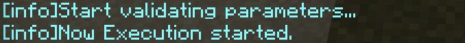

## 欢迎使用NC！

NormaConstructor是一个多平台的基岩版创世神插件。它允许你无论是在单人游戏还是多人游戏中皆可随心所欲的创建简单几何体，预置建筑甚至[红石音乐](https://www.bilibili.com/video/BV1NA41137on/)！我们力图为使用者提供尽可能简单的操作方法，同时确保其功能足够足够强大以应对诸位各种复杂的需求。
## 安装NC

使用NC时，玩家需要其配套行为包提供的自定义工具来设置参数。所以即便是使用lxl版NC（Integral）的玩家也需要安装addon。

对于win10单机版（基于scripting版本）的使用者，如minebbs所述，从<https://github.com/NorthernOceanS/NormaConstructor/releases>下载最新版即可。

对上述提到的lxl版NC（Integral）的使用者，请下载并导入<https://www.minebbs.com/threads/integral-nc-lxl-addon.7646/>。

## 快速上手
### 准备工作

在上一步中，NC应该已经成功地将自定义工具添加进你的游戏。创造模式下打开物品栏，或键入`give @s` 并试图补全命令（所有NC自定义工具的命名空间均为`normaconstructor`）都可帮助你确认这一步是否成功。

现在输入`/function getTools`，这条命令将使你快速获得使用NC所需的全部工具。你可以仅留下`get_position` 、`remove_last_position` 、`remove_last_blocktype` 与`execute` ，暂时将其余物品放入物品栏。
### 示例：两点生成长方体

两点生成长方体是NC启动后第一个加载的功能。要使用它，首先用`getPosition`点击想要填满的两点。设定坐标时如果成功，NC会向你提示以下信息。

如果你已经设置好两个坐标，再次试图设置时新坐标不会被接受，此时NC会向你提示：

设置了错误的坐标怎么办？`remove_last_position`会帮助你删除上一个设置坐标。

接下来需要设置一种方块类型。设置方块类型的做法是，直接在地上放置一个方块。类似的，此时NC会提示你

删除上一个方块类型（对两点生成来说，只有一个类型）所用的是`remove_last_blocktype`

第一行表示NC正在试图删除这一方块类型，第二行则是已保存的方块类型列表。可以看到这里只有一个`null`，这表示目前列表为空，可以接受新的数据。

设置完成后，使用execute点地。NC会提示

一般而言生成就成功了。你应当看到一个长方体。

若参数有问题，NC会指出出现问题的原因。如下为一个例子

## 进一步了解

NC作为类worldedit的插件，在其行为模式上却与其略有不同。worldedit的各种操作都需要通过命令执行，而目前来说，NC更多地使用游戏内物品与交互界面来允许用户设置各种参数。另外，NC引入了**生成器**这一概念。
### 生成器

NC的每一个功能背后都是一个生成器。一个生成器接受你所设置的参数，并当你使用`execute`时，会先检验你的参数，没有问题后再根据你所提供的参数生成一系列放置方块的指令。其因此得名。

每个生成器彼此独立，其存放的数据不互通。

对于普通的使用者，对生成器不必了解过多。如果有感兴趣的开发者想创造自己的生成器，欢迎参考开发文档。
### NC所用工具

在blocklauncher时代，远古大神6g3y所做的快速建造，监听玩家点击（相当于鼠标右键）地面的事件，并由此设置坐标、方块，或直接开始生成。

NC更加“严谨”一些。这些功能被拆分，并分配给单一的工具。具体来说，NC使用的工具有

| 参数设置工具 | `get_position,getdirection,(直接放置方块),get_air`  |
| ------------- | ------------- |
| 参数删除工具 | `remove_last_position,remove_last_direction,remove_last_blocktype` |
| 其它工具 | show_menu,show_saved_data,execute,choose_next_generator |

`get_air`用来将空气方块设置为方块类型的参数。“其它工具中”：

**show_menu** 用来打开ui。在NC中，ui的主要功能是设置数字或字符串的参数，例如在生成球中，球的半径。win10单机版NC另支持切换生成器和设置用户数据（如日志输出等级），但因表单限制这无法在lxl版做到。

**show_saved_data** 会输出在当前生成器下你已经设置的参数与你的用户数据。

**choose_next_generator** 用来切换到下一个生成器。在lxl版这是唯一的切换方法，这一点将在未来有所改变。
## 最后
关于其它生成器的使用方法，敬参考：<https://www.bilibili.com/video/BV1Wh411d7QN/>

如果你没有看懂上面的教程，可以阅读[另一个教程](yet-another-tutorial.md)
